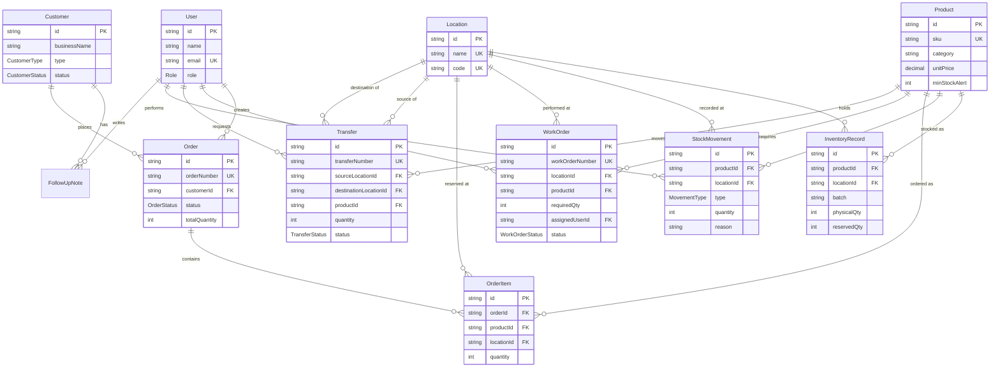

# Mini Operations ERP

A small internal Operations ERP for a company running multiple locations, covering the flow:
**Inventory → Work Order → Stock Check → Internal Transfer / Shortage → Customer Reservation.**
Also retains a lightweight Customer CRM (contact/business details, follow-up notes) that
Customer Orders are placed against. Role-based access for three internal staff roles: ADMIN,
OPERATIONS, SALES.

## Tech Stack

- **Backend:** Node.js, TypeScript, Express, Prisma ORM 6
- **Database:** PostgreSQL (Supabase)
- **Auth:** JWT (`jsonwebtoken`, `bcryptjs`), role-based access control
- **Validation:** Zod
- **Testing:** Jest + Supertest, against an isolated Postgres schema
- **Frontend:** React + Vite, Tailwind CSS, react-router-dom, axios, Framer Motion, lucide-react

## Architecture

```
mini-erp-crm/
├── server/     routes/ -> middleware/ -> controllers/ -> lib/  (Express + Prisma)
└── client/     context/ -> pages/ (one folder per module)      (React + Vite)
```

**Backend:** `routes/` maps URL + method to a controller and declares which guards apply
(`authMiddleware` verifies the JWT, `roleGuard([...])` checks the role) — no business logic
there. `controllers/` validate the request against a Zod schema, then query/mutate via Prisma,
throwing `AppError(status, message)` for expected failures (validation, not found, business
rules) so error formatting stays consistent everywhere. `app.ts` builds the Express app
(routes+middleware, no listener) so tests can import it directly with Supertest; `index.ts` is a
thin `app.listen()` wrapper.

**Concurrency-safe stock mutations (the core business logic):** every flow that changes stock —
reserving an order, dispatching/receiving a transfer, completing a work order, a manual inventory
adjustment — goes through `lib/inventoryLock.ts`'s `lockInventoryRecord()`, which takes a raw
`SELECT ... FOR UPDATE` on the target `InventoryRecord` row inside the caller's `$transaction`
before validating/writing. A plain read-then-check-then-write lets two concurrent requests both
read the same stale quantity and both pass validation; the row lock forces the second transaction
to wait and see the first one's committed result instead. Multi-line operations (an order with
several items, a work order consuming across batches) lock rows in a fixed sort order so
concurrent operations touching overlapping rows can't deadlock each other. Receiving a transfer
additionally locks the `Transfer` row itself and checks its status before touching any inventory,
which is what actually prevents the same transfer being received twice under concurrent requests
(not just a pre-check a race could slip past).

**Frontend:** mirrors the backend's module boundaries (`pages/customers`, `pages/workorders`,
`pages/transfers`, `pages/orders`, plus `pages/InventoryListPage.jsx` and `pages/products` for
the item catalog). Auth state lives in React Context; an axios interceptor attaches the JWT to
every request and clears storage + redirects to `/login` on any `401`.

## Setup

### Backend
1. `cd server && npm install`
2. Copy `.env.example` to `.env` and fill in real values (see table below)
3. `npx prisma migrate deploy` (applies existing migrations) — for a brand new database, or after
   pulling schema changes
4. `npx prisma db seed` — creates the 3 test users, 2 locations, and starter inventory
5. `npm run dev` — runs on `http://localhost:<PORT>`
6. `GET /health` should return `{ "status": "ok" }`

### Frontend
1. `cd client && npm install`
2. Copy `.env.example` to `.env`, set `VITE_API_URL` to the backend URL
3. `npm run dev` — runs on `http://localhost:5173`

### Environment Variables (server)

| Key | Description |
|---|---|
| `DATABASE_URL` | Supabase Transaction pooler, port 6543, `?pgbouncer=true` — used at runtime |
| `DIRECT_URL` | Supabase Session pooler, port 5432 — used by Prisma Migrate |
| `JWT_SECRET` | Secret used to sign/verify JWTs |
| `PORT` | Port the Express server listens on |
| `CLIENT_URL` | Deployed frontend origin — CORS falls back to this if `CORS_ORIGINS` is unset |
| `CORS_ORIGINS` | Optional comma-separated allow-list, takes priority over `CLIENT_URL` |

## Test Credentials

All 3 roles share one password (dev/test-only, never do this in production).

| Email | Password | Role |
|---|---|---|
| `admin@example.com` | `Password123!` | ADMIN |
| `operations@example.com` | `Password123!` | OPERATIONS |
| `sales@example.com` | `Password123!` | SALES |

## API Endpoints

| Method | Path | Auth | Description |
|--------|------|------|--------------|
| GET | `/health` | none | Liveness + DB connectivity check |
| POST | `/auth/login` | none | Returns `{ token, user }` |
| GET | `/auth/me` | Bearer token | Current user's profile |
| GET | `/users` | any role | List users, optional `?role=` filter (assignee pickers) |
| GET | `/customers` | any role | Paginated list. Query: `page`, `pageSize`, `search`, `type`, `status` |
| GET | `/customers/:id` | any role | Detail, includes follow-up notes |
| GET | `/customers/:id/follow-ups` | any role | Paginated follow-up notes |
| POST | `/customers` | ADMIN, SALES | Create |
| PATCH | `/customers/:id` | ADMIN, SALES | Partial update |
| POST | `/customers/:id/follow-ups` | ADMIN, SALES | Add a follow-up note |
| GET | `/locations` | any role | List locations |
| POST | `/locations` | ADMIN | Create |
| GET | `/products` | any role | Catalog list. Query: `page`, `pageSize`, `search`, `category` |
| GET | `/products/:id` | any role | Catalog detail |
| POST | `/products` | ADMIN, OPERATIONS | Create (catalog only — no stock fields) |
| PATCH | `/products/:id` | ADMIN, OPERATIONS | Edit catalog fields |
| GET | `/inventory` | any role | InventoryRecord list (Item x Location x Batch). Query: `page`, `pageSize`, `search`, `category`, `locationId`, `productId`, `lowStock` |
| GET | `/inventory/:id` | any role | Single record, with computed `availableQty`/`isLowStock` |
| GET | `/inventory/:id/movements` | any role | Paginated stock movement history for that record |
| POST | `/inventory/adjust` | ADMIN, OPERATIONS | Manual IN/OUT against `{productId, locationId, batch, quantity, type, reason}` |
| GET | `/work-orders` | any role | Paginated list, each with computed `shortage`. Query: `page`, `pageSize`, `status`, `locationId` |
| GET | `/work-orders/:id` | any role | Detail with `availableAtLocation`/`shortage` |
| POST | `/work-orders` | ADMIN | Create — `{locationId, productId, requiredQty, assignedUserId}` |
| PATCH | `/work-orders/:id/status` | ADMIN, OPERATIONS | Advance one step: ASSIGNED → IN_PROGRESS → COMPLETED (completion consumes stock; fails if shortage unresolved) |
| GET | `/transfers` | any role | Paginated list. Query: `page`, `pageSize`, `status` |
| GET | `/transfers/:id` | any role | Detail |
| POST | `/transfers` | ADMIN, OPERATIONS | Request — `{sourceLocationId, destinationLocationId, productId, batch?, quantity}` |
| POST | `/transfers/:id/dispatch` | ADMIN, OPERATIONS | REQUESTED → DISPATCHED: decrements source |
| POST | `/transfers/:id/receive` | ADMIN, OPERATIONS | DISPATCHED → RECEIVED: increments destination; rejects if not DISPATCHED (no double-receive) |
| GET | `/orders` | any role | Paginated list. Query: `page`, `pageSize`, `status`, `customerId` |
| GET | `/orders/:id` | any role | Detail (customer + line items) |
| POST | `/orders` | ADMIN, SALES | Create — reserves stock immediately. `{customerId, items: [{productId, locationId, batch?, quantity}]}` |
| POST | `/orders/:id/fulfill` | ADMIN, SALES | RESERVED → FULFILLED: converts reservation into a physical deduction (shipped) |
| POST | `/orders/:id/cancel` | ADMIN, SALES | Releases the reservation (if RESERVED) or restocks (if FULFILLED) |

### Postman Collection

[`Mini-ERP-CRM.postman_collection.json`](./Mini-ERP-CRM.postman_collection.json) at the repo
root. Import it, run **Auth > Login (Admin)** first (auto-captures the token), then run any
request — IDs are captured automatically from `Create` responses. The `baseUrl` variable
defaults to `http://localhost:5000`; change it to the live backend URL above to hit the
deployed API instead.

## Database Schema

### ER Diagram



`InventoryRecord` is the entity that answers "how much of this Item exists at this Location in
this Batch" — it's the only place `physicalQty`/`reservedQty` are stored; everything else
(shortage on a Work Order, dispatch/receive on a Transfer, reserve/fulfill on an Order) reads or
mutates it through `lib/inventoryLock.ts`.

### Entities

Defined in `server/prisma/schema.prisma`:

- **User** — staff accounts, one of 3 roles (ADMIN / OPERATIONS / SALES)
- **Customer** — CRM record (type, status, follow-up date, notes)
- **FollowUpNote** — many-per-customer follow-up log, linked to the user who wrote it
- **Product** — catalog record only: SKU, category, unit price, min stock alert (no stock fields)
- **Location** — a physical site (warehouse, branch, …)
- **InventoryRecord** — the actual stock: one row per `Product x Location x Batch`, with
  `physicalQty` and `reservedQty` (`availableQty = physicalQty - reservedQty` is computed in the
  API response, not stored)
- **StockMovement** — audit log of every stock change (IN/OUT, quantity, reason, product,
  location, batch, who, when)
- **WorkOrder** — a material request against a location (required quantity, assigned user,
  ASSIGNED / IN_PROGRESS / COMPLETED)
- **Transfer** — an internal stock move between two locations (REQUESTED / DISPATCHED / RECEIVED)
- **Order** — a customer order (RESERVED / FULFILLED / CANCELLED)
- **OrderItem** — line items; stores a snapshot of `productName`/`sku`/`unitPrice` at creation
  time (in addition to the live `productId`), so historical orders stay accurate even if a
  product's price or name changes later

## Deployment

Designed to run on Render (backend) + Vercel (frontend) + Supabase (database), all free tier, but
not tied to any of them specifically — all config is environment-driven (see below). Not
currently deployed; run locally per [Setup](#setup).

- **Backend (Render):** root dir `server/`. Build: `npm install && npx prisma migrate deploy &&
  npm run build`. Start: `npm run start`. Env vars: `DATABASE_URL`, `DIRECT_URL`, `JWT_SECRET`,
  `CLIENT_URL` (`PORT` is injected automatically).
- **Frontend (Vercel):** root dir `client/`. Build: `npm run build`, output `dist`. Env var:
  `VITE_API_URL` = the backend URL. `client/vercel.json` rewrites all paths to `index.html` so
  client-side routes don't 404 on a hard refresh.
- **Deploy order:** the backend needs the frontend's URL (`CLIENT_URL`) and the frontend needs
  the backend's URL (`VITE_API_URL`) — deploy the backend first with `CLIENT_URL` left on its
  localhost default, deploy the frontend once the backend URL exists, then go back and update
  `CLIENT_URL` on the backend and redeploy.

## How to Test

```
cd server
npm test
```

Spins up an isolated `test` schema on the same Postgres instance as dev (via `prisma db push`,
not migration replay), runs Jest + Supertest against the real Express app (`src/app.ts`,
imported directly — no port binding), and drops the schema afterward. Real Postgres, not a
mocked Prisma client, since the behavior under test is row-locking/transaction semantics that a
mock can't exercise meaningfully. Covers the 5 mandatory cases plus a concurrency proof:

1. Cannot reserve more than available inventory (`tests/order.test.ts`)
2. Cannot transfer more than available inventory (`tests/transfer.test.ts`)
3. Destination stock increases only after transfer receipt (`tests/transfer.test.ts`)
4. Same transfer cannot be received twice (`tests/transfer.test.ts`)
5. Unauthorized user cannot perform a restricted operation (`tests/auth.test.ts`)
6. *(bonus)* Two concurrent over-committing reservations — only one succeeds (`tests/order.test.ts`)

Also covers work-order shortage calculation and forced-single-step status transitions
(`tests/workOrder.test.ts`).

## Key Design Decisions

- **Row-level locking, not just transactions** — see [Architecture](#architecture) above.
  `$transaction` alone (Postgres's default READ COMMITTED isolation) does not stop two concurrent
  requests from both reading the same pre-write quantity; `SELECT ... FOR UPDATE` inside the
  transaction does.
- **Inventory is `Product x Location x Batch`, not a single number on Product** — matches the
  brief's model directly and is what makes Work Orders (shortage at *a* location) and Transfers
  (moving stock *between* locations) meaningful.
- **Orders reserve at creation, not at a separate confirm step** — `reservedQty` is incremented
  immediately and validated against `Available` (`physical - reserved`); `fulfill` later converts
  that reservation into an actual physical deduction (shipped), and `cancel` reverses whichever of
  the two is currently in effect.
- **`currentStock`/`location` fields don't exist on Product anymore** — the only way to see or
  change stock is through `/inventory`, so the audit log (`StockMovement`) and the
  physical/reserved split have zero exceptions.
- **Login returns the same `401` for "no such user" and "wrong password"** — can't be used to
  enumerate registered emails.
- **Read access is open to any authenticated role; writes are scoped to the role that owns that
  function** — SALES for customers/orders, OPERATIONS (+ ADMIN) for inventory/transfers/work-order
  status, ADMIN-only for creating a Work Order (per the brief) — while everyone can still read
  across modules.
- **CORS is env-driven** (`CORS_ORIGINS` / `CLIENT_URL`), not hardcoded — the brief requires
  environment-based configuration, and it means a new deployed frontend origin never needs a code
  change.
- **Prisma pinned to v6, not v7** — avoids v7's driver-adapter/`prisma.config.ts` requirement;
  `.env` is read directly via the schema's `datasource` block.
- **JWT stored in `localStorage`, not an `httpOnly` cookie** — standard SPA pattern; trades some
  XSS exposure for avoiding CSRF handling, acceptable at this project's scope.

## Known Limitations

- **Work order completion consumes from the DEFAULT/first-available batches at a location in a
  fixed order**, not a configurable FIFO/FEFO policy — fine at this project's scale.
- **Transfer/Order line items can't be partially received or partially fulfilled** — a transfer is
  received (or not) as a whole, and an order line reserves/ships its full requested quantity.
  Partial receipt is a natural next step (see the brief's example "Live Verification" changes).
- **Order/Transfer numbering can theoretically race.** `SO-<year>-<0001>`/`TR-<year>-<0001>` use a
  count-based sequence inside the create transaction — correct at this project's scale, but two
  truly simultaneous creates could compute the same count before either commits.
- **Low-stock filtering runs in application code, not the database** — Prisma can't compare two
  columns of the same row (`physicalQty < product.minStockAlert`) in a `where` clause without raw
  SQL.
- **Test suite hits Supabase over the network** (an isolated `test` schema, not a local
  container) — occasionally slower or flakier under load than a local Postgres would be; rerun on
  a timeout.
- **No refresh-token flow.** The JWT expires after 8h and the user has to log in again.
- **No password-reset flow, no rate-limiting on login.**
- **No notification system** — shortages and low-stock indicators are visible in the UI, but
  nothing proactively alerts anyone.
- **No edit history for Customer or Product records themselves** — `StockMovement` fully audits
  stock changes, but there's no log of who changed a customer's address or a product's price.
